# Interface do Usuário Final  Sprint 5

## Sistema de Gestão de Aulas de Música  Marcos Music

Documento de Interface Atualizado e Unificado (Sprint 5)

---

## 1. Visão Geral

Este documento apresenta a especificação completa e atualizada da interface do usuário para a plataforma **Marcos Music** (Sistema de Gestão de Aulas de Música). Ele unifica e atualiza as diretrizes visuais e comportamentais da Sprint 4 (Alertas e Integração WhatsApp) com o template consolidado das demais telas de gestão do sistema (Agenda, Disponibilidade, Reagendamentos, Videoaulas e Gestão de Alunos).

A interface foi projetada utilizando práticas modernas de desenvolvimento front-end com **React, TypeScript, Tailwind CSS e Framer Motion**, garantindo interações fluidas, layouts responsivos e uma experiência extremamente premium (estética de alta fidelidade baseada em glassmorfismo e micro-animações).

> **Nota:** As seções a seguir incluem capturas de tela reais do sistema em funcionamento, capturadas em **10/06/2026** com dados reais do ambiente de produção (banco de dados Azure SQL Server).

### 1.1. Landing Page e Tela de Login

| Landing Page | Tela de Login |
|:---:|:---:|
|  | 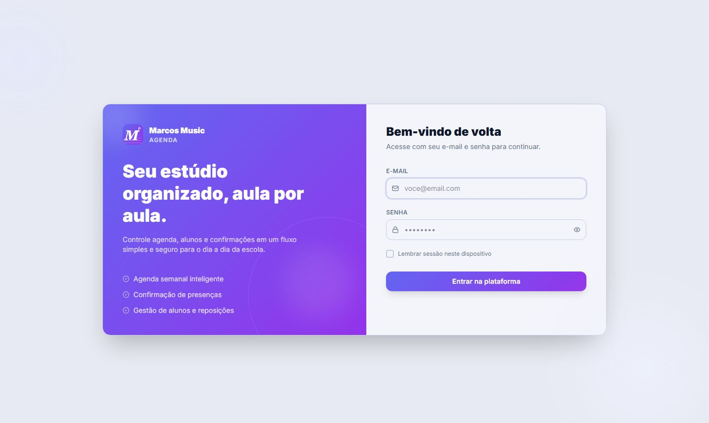 |

---

## 2. Design System & Identidade Visual

Para proporcionar uma experiência premium e contemporânea, o sistema afasta-se de cores sólidas genéricas e implementa uma paleta baseada em variáveis HSL dinâmicas e tokens utilitários modernos, compatíveis com os modos Claro e Escuro.

### 2.1. Paleta de Cores e Semântica

| Estado / Tipo                  | Cor Base                    | Uso Prático na Interface                                    | Significado Semântico                       |
| :----------------------------- | :-------------------------- | :----------------------------------------------------------- | :------------------------------------------- |
| **Destaque/Acento**      | HSL Indigo/Purple           | Botões de ação primária, seleção ativa, bordas de foco | Identidade da marca, sofisticação          |
| **Não Lido / Alerta**   | HSL Slate Escuro            | Fundo em destaque para chamar a atenção na Central         | Item pendente de ação imediata             |
| **Urgente / Cancelado**  | HSL Rose (Vermelho suave)   | Badges de erro, botões de cancelamento, alertas críticos   | Erro, cancelamento ou prazo estourado        |
| **Pendente**             | HSL Amber (Amarelo/Laranja) | Aulas remarcadas pendentes, status de renegociação         | Processo em andamento, aguardando outro ator |
| **Sucesso / Confirmado** | HSL Emerald (Verde suave)   | Aulas confirmadas, mensalidade paga, sucesso de ação       | Sucesso, conformidade e fluxo concluído     |
| **Informativo**          | HSL Blue (Azul suave)       | Lembretes de aulas normais, informativos gerais              | Apenas informação de rotina                |

### 2.2. Tipografia e Micro-animações

* **Tipografia:** Uso da fonte *Inter* para elementos de controle e tabelas (alta legibilidade) e *Outfit* ou *Roboto* para cabeçalhos e números de destaque (estilo limpo e moderno).
* **Animações:** Transições suaves baseadas em `framer-motion` em todos os botões (hover com leve escala de `1.02`), modais surgindo com efeito *spring* e listas que aparecem de forma escalonada (*staggered entrance*).

---

## 3. Especificação das Telas e Componentes

### 3.1. Dashboard Dinâmico

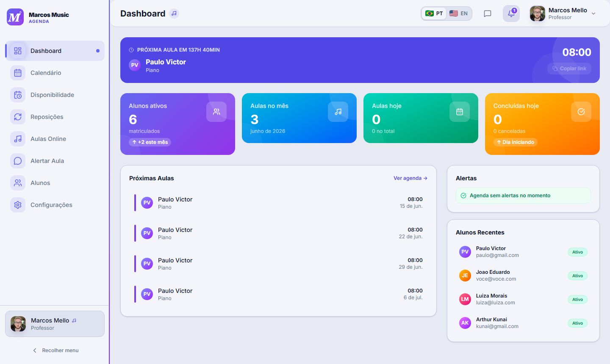

O painel de controle principal do professor oferece uma visão panorâmica instantânea sobre o status do seu dia de trabalho e de sua base de alunos.

#### Componentes e Elementos Visuais:

1. **Banner de Próxima Aula:** Um cartão premium localizado no topo com gradiente em roxo escuro, exibindo um contador regressivo dinâmico de tempo ("em 45min", "Acontecendo agora"), foto/avatar do aluno, instrumento de estudo e um botão com feedback tátil para copiar o link da sala virtual (`meetLink`) caso a aula seja online.
2. **Painel de Estatísticas Físicas (4 StatCards):**
   - *Alunos Ativos:* Total de alunos cadastrados e ativos no mês (com indicador de crescimento, ex: "+2 este mês").
   - *Aulas do Mês:* Quantidade total acumulada no período de faturamento.
   - *Aulas de Hoje:* Total de compromissos agendados para a data atual.
   - *Aulas Concluídas:* Contador de aulas de hoje que já mudaram o status para `completed` em relação às canceladas.
3. **Lista de Próximas Aulas (Próximos 5 Compromissos):** Grid contendo o dia, horário, nome e instrumento, com um indicador lateral colorido representando a cor de marcação personalizada da aula.
4. **Feed de Alertas Críticos Rápidos:** Mini-inbox contendo as últimas notificações urgentes de cancelamento ou reagendamento feitas pelos alunos no próprio dia.

---

### 3.2. Agenda do Professor

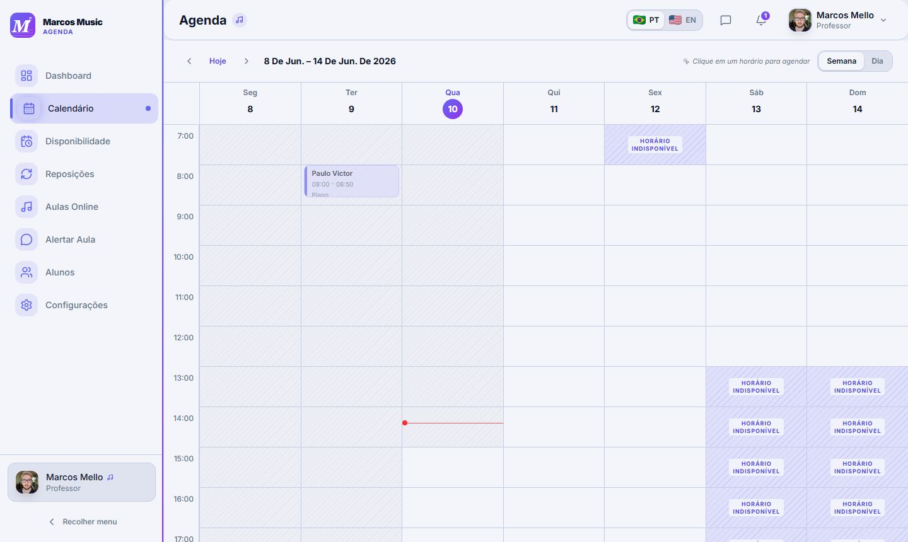

O centro de gerenciamento de horários do professor, projetado em formato de calendário altamente visual.

```
┌─────────────────────────────────────────────────────────────────────────────┐
│  AGENDA DO PROFESSOR                       [Filtros ▼]  [+ Nova Aula]       │
├─────────────────────────────────────────────────────────────────────────────┤
│  [ Visualizar: Semana / Dia ]                   < 20 a 26 de Maio, 2026 >    │
├─────────┬──────────────┬──────────────┬──────────────┬──────────────┬───────┤
│ Hora    │ Seg (20/05)  │ Ter (21/05)  │ Qua (22/05)  │ Qui (23/05)  │ ...   │
├─────────┼──────────────┼──────────────┼──────────────┼──────────────┼───────┤
│ 08:00   │              │              │ [Aula Pedro] │              │       │
├─────────┼──────────────┼──────────────┼──────────────┼──────────────┼───────┤
│ 09:00   │              │              │              │              │       │
├─────────┼──────────────┼──────────────┼──────────────┼──────────────┼───────┤
│ 10:00   │ [Aula Lucas] │              │              │              │       │
└─────────┴──────────────┴──────────────┴──────────────┴──────────────┴───────┘
```

#### Campos da Aula (Modal de Criação / Edição):

* **Aluno (Obrigatório):** Seleção direta a partir do cadastro de alunos.
* **Professor (Obrigatório):** Nome do instrutor responsável pela aula.
* **Instrumento (Opcional):** Violão, Piano, Teclado, Canto, etc.
* **Data (Obrigatório):** Data da aula no formato `DD/MM/AAAA`.
* **Horário Inicial (Obrigatório):** Horário de início da aula.
* **Horário Final (Obrigatório):** Horário de término da aula. *Regra de consistência:* Deve respeitar a duração padrão do contrato (mínimo de 50 minutos).
* **Tipo de Aula (Obrigatório):** Modalidade (Presencial, Online, Experimental).
* **Link da Aula (Obrigatório apenas se for modalidade Online):** URL para a reunião virtual.
* **Observações (Opcional):** Campo livre para anotações didáticas ou avisos.
* **Recorrência (Opcional):** Caixa de seleção indicando se o horário se repetirá semanalmente de forma automática.

#### Comandos Disponíveis:

1. `criar aula`: Abre o modal com formulário em branco.
2. `editar aula`: Abre os dados da aula selecionada para edição imediata.
3. `cancelar aula`: Altera o status para `cancelled` e, dependendo da antecedência, executa a **UC-07 (Gerenciar reposições)** gerando um crédito.
4. `mover aula (Drag and Drop)`: Permite arrastar um bloco de aula na grade para alterar o dia/horário de forma visual, aplicando a **UC-15 (Verificar disponibilidade de horários)** automaticamente.

---

### 3.3. Gestão de Disponibilidade do Professor

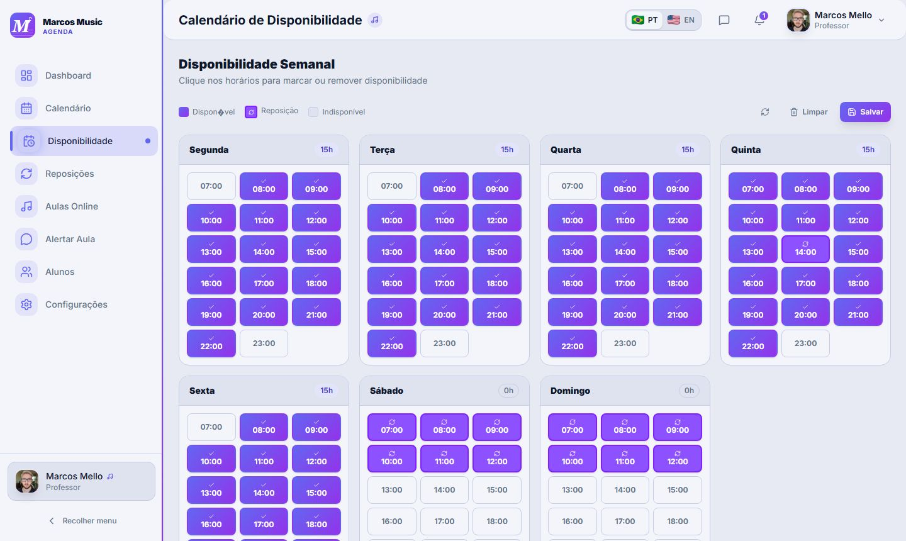

Esta tela permite que o professor cadastre seus blocos fixos de horários livres em que estará disponível para receber novos agendamentos e solicitações de reposição/reagendamento.

#### Campos de Cadastro:

1. **Dia da Semana (Obrigatório):** Enumeração de Segunda a Domingo.
2. **Horário de Início (Obrigatório):** Hora inicial do bloco.
3. **Horário de Fim (Obrigatório):** Hora final do bloco. *Restrição:* O horário final deve ser estritamente maior que o horário inicial.
4. **Modalidade Suportada (Opcional):** Presencial, Online ou Ambas.
5. **Local / Sala (Opcional):** Identificador físico da sala de aula para controle de lotação.

#### Ações Principais:

* `adicionar horário`: Insere um novo bloco de disponibilidade na lista semanal.
* `remover horário`: Remove permanentemente um bloco disponível.
* `editar horário`: Abre o bloco existente para edição direta.
* `salvar disponibilidade`: Persiste as alterações no banco de dados.

---

### 3.4. Central de Reagendamentos (Reposições)

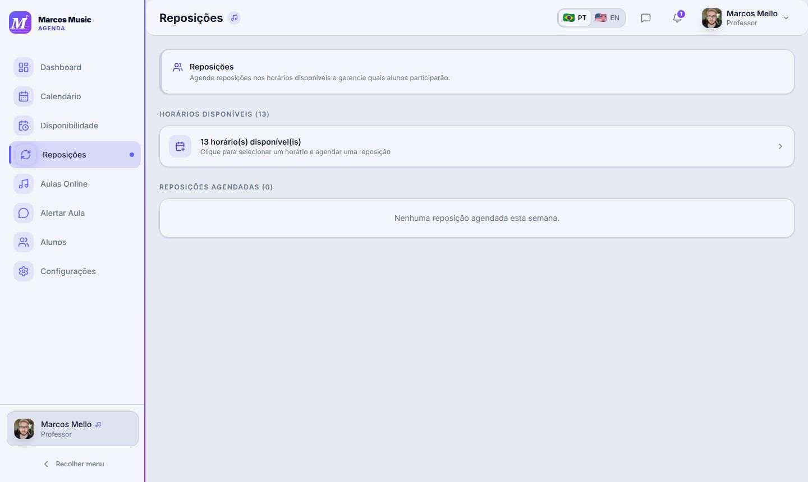

Modulo inteligente focado no tratamento de faltas e reagendamentos, integrando regras contratuais (**UC-14**).

#### Fluxo e Comportamento da Tela:

1. **Seleção de Aula Original:** Exibe as aulas marcadas como canceladas pelo aluno ou professor que geraram "direito a crédito".
2. **Match Inteligente de Horários:** O sistema lê a disponibilidade do professor (cadastrada na tela 3.3) e oferece uma listagem otimizada de horários disponíveis.
3. **Aplicação Automática de Regras (UC-14):**
   * *Prazo limite:* O sistema verifica se o cancelamento original foi feito com o prazo contratual correto (ex: 24h de antecedência) para permitir a reposição.
   * *Saldo de Reposições:* O sistema exibe o total de créditos que o aluno possui antes de aprovar o novo agendamento.
4. **Confirmação:** Ao escolher um horário, o sistema altera o status para `rescheduled` e envia uma notificação instantânea para ambas as partes.

---

### 3.5. Biblioteca de Videoaulas

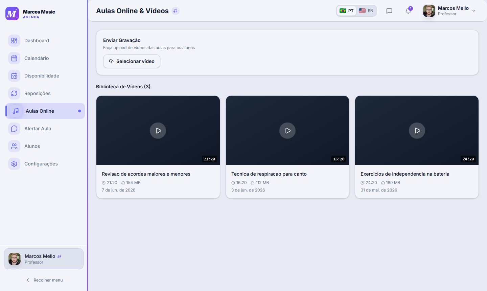

Área multimídia onde os alunos cadastrados podem assistir a materiais de apoio, videoaulas gravadas e lições semanais disponibilizadas pelo professor.

#### Campos e Especificações do Vídeo:

* **Título (Obrigatório):** Título descritivo da videoaula (ex: "Piano Básico - Aula 1").
* **Descrição (Opcional):** Resumo ou orientações adicionais sobre o conteúdo a ser praticado.
* **Instrumento (Opcional):** Filtro por disciplina para facilitar a localização pelo aluno.
* **Duração (Obrigatório):** Tempo total do vídeo formatado em `MM:SS`.
* **Link do Vídeo (Obrigatório):** URL do vídeo hospedado (YouTube, Vimeo, Drive, etc.).
* **Capa / Thumbnail (Opcional):** Imagem de visualização do conteúdo.
* **Categoria (Opcional):** Nível técnico (Iniciante, Intermediário, Avançado).
* **Status (Obrigatório):** Publicada, Oculta ou Rascunho.

#### Comandos Disponíveis:

* `pesquisar videoaula`: Barra de busca textual por título ou descrição.
* `assistir videoaula`: Abre o player embutido de alta performance.
* `cadastrar/editar videoaula`: Modais administrativos para o professor incluir novos materiais didáticos.

---

### 3.6. Gestão de Alunos

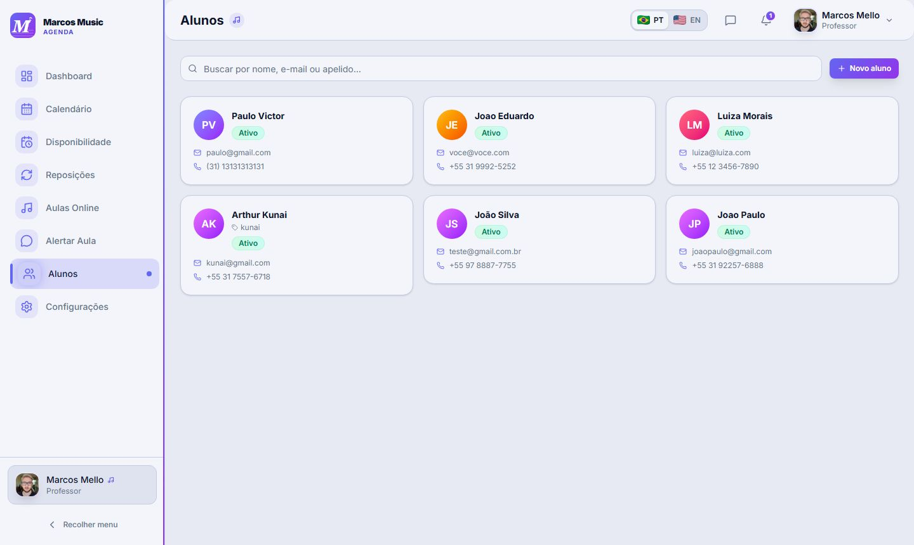

Painel administrativo para controle e cadastro de alunos, mantendo seus dados de contato e de contrato.

#### Campos de Cadastro do Aluno:

* **Nome Completo (Obrigatório):** Identificação oficial do aluno.
* **Apelido (Opcional):** Nome de tratamento preferido (utilizado para personalizar as variáveis das mensagens automáticas de WhatsApp, ex: "João" em vez de "João da Silva").
* **E-mail (Obrigatório):** Endereço eletrônico para login e envio de notificações formais.
* **Telefone (Obrigatório):** Número celular para contato direto e integração com o WhatsApp. *Formatado em nível internacional para a API.*
* **Status do Aluno (Obrigatório):** Ativo ou Inativo.
* **Créditos de Reposição:** Contador em tempo real do saldo de aulas que o aluno tem direito a repor.

---

### 3.7. Central de Alertas & Notificações

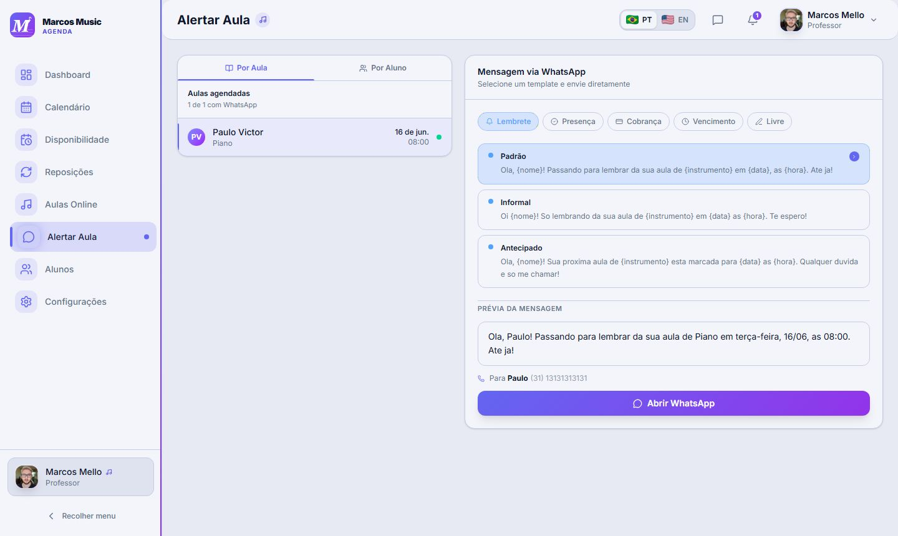

Uma caixa de entrada centralizada que avisa o professor (e os alunos) sobre mudanças cruciais no status das aulas.

```
┌─────────────────────────────────────────────────────────────────────────────┐
│  MARCOS MUSIC - CENTRAL DE ALERTAS                                    [x]   │
├─────────────────────────────────────────────────────────────────────────────┤
│  [Filtros: Todos ▼]              [Marcar tudo como lido]      [Limpar Lidos]│
├─────────────────────────────────────────────────────────────────────────────┤
│  ALERTAS NÃO LIDOS (3)                                                      │
├─────────────────────────────────────────────────────────────────────────────┤
│  ● [LEMBRETE]  Hoje 14:00 - João Silva                                      │
│    Aula não confirmada pelo aluno há 2 horas.                               │
│    [Aula de Violão]                                                         │
│                                                                             │
│  ● [URGENTE]   Hoje 16:30 - Maria Costa                                     │
│    Reposição pendente de confirmação de horário.                            │
│    [Aula de Piano]                                                          │
│                                                                             │
│  ● [ALTERAÇÃO] Amanhã 10:00 - Prof. Carlos Mendes                          │
│    Aula remarcada para novo horário: 11:00.                                 │
│                                                                             │
│  ALERTAS LIDOS (1)                                                          │
├─────────────────────────────────────────────────────────────────────────────┤
│    [CONFIRMADO] Ontem - Ana Silva (Aula de Canto confirmada)                │
└─────────────────────────────────────────────────────────────────────────────┘
```

#### Tipos de Alerta e Regras de Cores Dinâmicas:

1. **LEMBRETE (Azul):** Notificação de rotina de aula que se aproxima.
2. **URGENTE (Vermelho/Laranja):** Aulas canceladas na mesma data ou conflitos graves.
3. **ALTERAÇÃO (Amarelo):** Remarcações pendentes ou concluídas.
4. **CONFIRMADO (Verde):** Presença validada pelo aluno ou professor.

#### Ações no Alerta:

* **Clique Simples:** Abre o modal de Detalhe do Alerta (descrito em 3.7.1).
* **Marcar como Lido:** Altera visualmente o fundo do card para um tom mais claro e reduz a contagem de pendências no ícone principal.
* **Deletar Alerta:** Descarta o alerta do histórico.

#### 3.7.1. Detalhe do Alerta (Modal Contextualizado)

Ao clicar em qualquer alerta da lista, abre-se uma visualização detalhada que exibe todos os dados da aula atrelada, o motivo de geração do alerta, o histórico cronológico da notificação ("Criado às 09:15", "Visualizado às 12:00") e um conjunto de **Ações Contextuais Inteligentes**:

* *Botão 1:* **[ Confirmar Presença ]** (Altera o status de confirmação diretamente no banco de dados).
* *Botão 2:* **[ Cancelar Aula ]** ou **[ Reagendar Aula ]** (Redireciona para o fluxo correspondente).
* *Botão 3:* **[ Falar no WhatsApp ]** (Abre o fluxo de integração externo detalhado em 3.8).

---

### 3.8. Integração e Envio via WhatsApp

Funcionalidade extremamente prática que permite ao professor disparar mensagens de contato direto pré-formatadas para o WhatsApp Web ou WhatsApp App do aluno, poupando a digitação manual de mensagens repetitivas.

#### Mecanismo de Funcionamento:

Ao acionar o botão "Falar no WhatsApp" em qualquer tela (Alertas, Agenda ou Alunos), o sistema renderiza um modal de preparação de mensagem:

```
┌─────────────────────────────────────────────────────────────────────────────┐
│  Preparar Mensagem para WhatsApp                                      [x]   │
├─────────────────────────────────────────────────────────────────────────────┤
│  Destinatário: João Silva                                                   │
│  Telefone: +55 (31) 98765-4321                                              │
│                                                                             │
│  TEXTO DA MENSAGEM (PRÉVIA):                                                │
│  ┌───────────────────────────────────────────────────────────────────────┐  │
│  │ Olá João! Passando para lembrar da sua aula de Violão de hoje (20/05) │  │
│  │ às 14:00. Se houver qualquer imprevisto, me avise por aqui!           │  │
│  └───────────────────────────────────────────────────────────────────────┘  │
│                                                                             │
│  [Categoria do Template: Lembrete ▼]                                        │
│  [Editar Mensagem Manualmente ▼]                                            │
│                                                                             │
│  [ Cancelar ]                                    [ Enviar no WhatsApp → ]   │
└─────────────────────────────────────────────────────────────────────────────┘
```

#### Variáveis Suportadas nos Templates Dinâmicos:

* `{nome}`: Injeta automaticamente o apelido do aluno (ou o primeiro nome).
* `{instrumento}`: Injeta o nome do instrumento musical da aula (ex: "Bateria").
* `{data}`: Injeta o dia da semana e a data da aula (ex: "quarta-feira, 22/05").
* `{hora}`: Injeta o horário de início formatado (ex: "14:30").

#### Templates Disponíveis por Categoria:

1. **Lembrete de Aula:**
   - *Opção Padrão:* `"Olá, {nome}! Passando para lembrar da sua aula de {instrumento} em {data}, às {hora}. Até já!"`
   - *Opção Informal:* `"Oi {nome}! Só lembrando da sua aula de {instrumento} em {data} às {hora}. Te espero!"`
2. **Confirmação de Presença:**
   - *Opção Direta:* `"Oi {nome}! Você vai conseguir comparecer à aula de {instrumento} no dia {data} às {hora}? Me confirma aqui!"`
3. **Cobrança Amigável:**
   - *Opção Padrão:* `"Olá, {nome}! Tudo bem? Passando para avisar que sua mensalidade de {instrumento} está em aberto. Pode me chamar para acertar!"`
4. **Vencimento de Mensalidade:**
   - *Opção Antecipada:* `"Olá, {nome}! Só um aviso: o vencimento da sua mensalidade de {instrumento} se aproxima em 5 dias. Estou à disposição!"`

#### Comportamento do Botão "Enviar no WhatsApp":

O sistema gera dinamicamente uma URL utilizando a API oficial do WhatsApp (`https://api.whatsapp.com/send?phone=...&text=...`), convertendo caracteres especiais em codificação URI amigável e abrindo uma nova aba no navegador do usuário, direcionando para o envio da mensagem. *O sistema não envia a mensagem de forma automática invisível (por segurança e respeito às políticas do WhatsApp), mas sim redireciona com o texto 100% preenchido pronto para envio.*

---

### 3.9. Chat entre Aluno e Professor

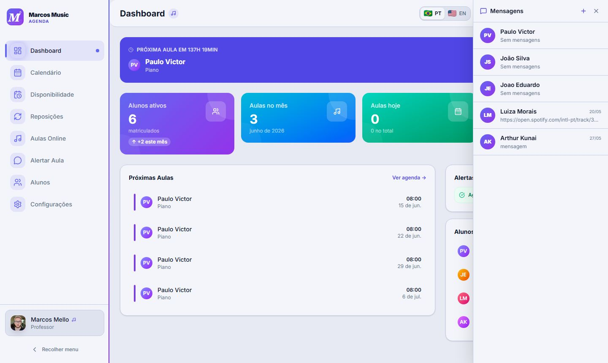

Canal de comunicação direta integrado à plataforma, acessível pelo ícone de mensagens na barra superior (*TopBar*). O badge exibe o total de mensagens não lidas e é atualizado automaticamente.

```
┌──────────────────────────────────────────────────────────────────────────────┐
│  MENSAGENS                                                              [x]  │
├───────────────────────────┬──────────────────────────────────────────────────┤
│  CONVERSAS                │  João Silva                                      │
│  ───────────────────────  │  ──────────────────────────────────────────────  │
│  ● João Silva        [2]  │                    Hoje, 14:05                   │
│    Última: ótimo!         │  ┌─────────────────────────────────────────────┐ │
│                           │  │ João: Oi professor, posso faltar na quinta? │ │
│  ○ Maria Costa            │  └─────────────────────────────────────────────┘ │
│    Última: ok             │                                                  │
│                           │   ┌──────────────────────────────────────────┐   │
│  ○ Lucas Pereira          │   │ Prof: Pode sim, mas lembra de reagendar! │   │
│    Última: obrigado       │   └──────────────────────────────────────────┘   │
│                           │                                                  │
│                           │  ┌──────────────────────────────┐  [ Enviar → ] │
│                           │  │ Digite uma mensagem...        │               │
│                           │  └──────────────────────────────┘               │
└───────────────────────────┴──────────────────────────────────────────────────┘
```

#### Comportamento por Perfil:

* **Professor (ADMIN):** visualiza a lista lateral com todos os alunos que possuem conversa iniciada. Balões do professor aparecem alinhados à **direita** (cor de acento da marca). Pode iniciar conversa com qualquer aluno cadastrado.
* **Aluno:** acessa diretamente o chat com o professor, sem lista lateral — abre sempre a conversa única. Seus balões aparecem alinhados à **esquerda** (cinza neutro).

#### Elementos Visuais:

* **Badge de não lidas:** número em círculo vermelho sobre o ícone de mensagens no *TopBar*, atualizado automaticamente.
* **Indicador de conversa não lida:** nome do aluno em destaque (bold) e indicador `●` colorido na lista lateral do professor.
* **Marcação como lido:** ao abrir uma conversa, todas as mensagens pendentes são marcadas como lidas automaticamente (via `PUT /{chatId}/ler`).
* **Timestamp:** hora de envio exibida discretamente abaixo de cada balão.

#### Comandos Disponíveis:

* `selecionar conversa` *(Professor)*: Abre o chat com o aluno selecionado na lista lateral.
* `enviar mensagem`: Campo de texto com envio por botão **[ Enviar → ]** ou tecla *Enter*.
* `marcar como lido`: Executado automaticamente ao abrir a conversa.

---

### 3.10. Central de Notificações

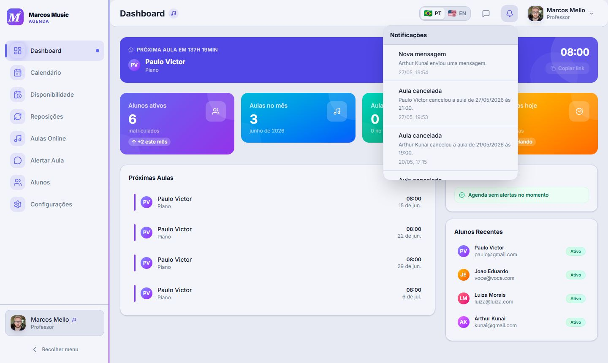

Sistema de notificações in-app acessível pelo ícone de sino (**Bell**) na barra superior. O badge exibe a contagem de itens não lidos e é atualizado automaticamente a cada 10 segundos (polling), ao mudar de página e ao retornar ao foco da aba.

```
┌──────────────────────────────────────────────────────────────┐
│  Notificações                             [ 3 novas ]        │
├──────────────────────────────────────────────────────────────┤
│  ● Aula confirmada                                           │
│    João confirmou presença para hoje às 14h.                 │
│    20/05  14:05                                              │
├──────────────────────────────────────────────────────────────┤
│  ● Aula reagendada                                           │
│    Maria remarcou a aula de quinta para sexta às 10h.        │
│    20/05  12:30                                              │
├──────────────────────────────────────────────────────────────┤
│  ○ Lembrete de amanhã                                        │
│    Aula com Lucas Pereira amanhã às 09h.                     │
│    19/05  18:00                                              │
└──────────────────────────────────────────────────────────────┘
```

*( `●` = não lida  |  `○` = já lida )*

#### Tipos de Notificação Gerados Automaticamente:

| Tipo                  | Disparado quando…                                                 |
| :-------------------- | :---------------------------------------------------------------- |
| `LEMBRETE_HOJE`       | Existe aula marcada para o dia atual                              |
| `LEMBRETE_AMANHA`     | Existe aula marcada para o dia seguinte                           |
| `AULA_AGENDADA`       | Uma nova aula é criada no sistema                                 |
| `AULA_REAGENDADA`     | Data/horário de uma aula é alterado                               |
| `AULA_CANCELADA`      | Uma aula é cancelada                                              |
| `CONFIRMOU_PRESENCA`  | Aluno confirma presença em uma aula                               |
| `REPOSICAO_AGENDADA`  | Uma reposição é agendada                                          |
| `REPOSICAO_REMOVIDA`  | Uma reposição é removida                                          |
| `NOVA_MENSAGEM`       | Nova mensagem recebida no chat                                    |

#### Comportamento do Painel:

* Ao **abrir** o painel, todas as notificações visíveis são marcadas como lidas automaticamente (`PUT /notificacao/ler-todas`).
* O painel exibe até **20 notificações** mais recentes, com scroll vertical.
* Notificações não lidas aparecem com fundo destacado e indicador colorido (●); lidas ficam em fundo neutro (○).
* O campo de data/hora é formatado conforme o idioma da interface (PT-BR ou EN-US).

#### Configurações de Notificação (em Configurações → Notificações):

```
┌──────────────────────────────────────────────────────────────┐
│  NOTIFICAÇÕES                                                │
├──────────────────────────────────────────────────────────────┤
│  Aulas agendadas                    [ Toggle ON  ]           │
│  Receber alertas sobre aulas                                 │
├──────────────────────────────────────────────────────────────┤
│  Pagamentos                         [ Toggle OFF ]           │
│  Cobranças vencendo e em atraso                              │
├──────────────────────────────────────────────────────────────┤
│  Mensagens                          [ Toggle ON  ]           │
│  Mensagens de alunos e professores                           │
└──────────────────────────────────────────────────────────────┘
```

Três toggles independentes permitem ao usuário habilitar ou desabilitar cada categoria de notificação sem afetar as demais.

---

## 4. Tela de Configurações

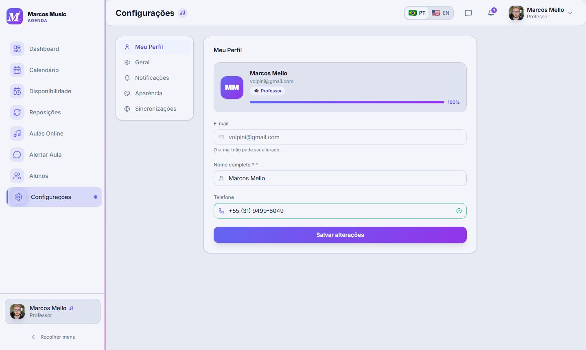

---

## 5. Requisitos Não Funcionais de Interface

1. **Responsividade Multiplataforma:** A interface deve ser 100% fluida, adaptando-se perfeitamente de telas de smartphones (360px de largura) a monitores desktop de alta resolução (Full HD e superiores).
2. **Desempenho de Renderização:** O carregamento e renderização da lista de alertas na central deve acontecer em um tempo menor que **1.5 segundos**.
3. **Navegabilidade Acessível (Foco em Cliques):** O usuário deve levar no máximo **2 cliques** de navegação a partir do Dashboard para realizar qualquer ação crítica (confirmar presença, abrir WhatsApp, etc.).
4. **Resiliência e Feedback Visual:** Qualquer falha de carregamento de APIs do backend deve disparar um estado de erro amigável (*Skeleton screen* ou Toast informativo de falha), mantendo a tela interativa.

---

## 6. Casos de Erro de Interação e Tratamento Visual

| Cenário de Erro                                       | Comportamento Esperado da Interface                                                                      | Feedback para o Usuário                                                                                                 |
| :----------------------------------------------------- | :------------------------------------------------------------------------------------------------------- | :----------------------------------------------------------------------------------------------------------------------- |
| **WhatsApp indisponível**                       | Exibe um modal de instrução ou Toast informativo de suporte.                                           | *"Abra ou configure o WhatsApp no seu aparelho para prosseguir."*                                                      |
| **Telefone do aluno não cadastrado**            | O botão "Falar no WhatsApp" fica desabilitado com aviso explicativo (*Tooltip*).                      | *"Configure o número de telefone nas configurações do aluno."*                                                      |
| **Falha de montagem de placeholders**            | O sistema intercepta o erro de mapeamento e carrega o texto limpo com placeholders genéricos.           | Envia a mensagem padrão sem campos em branco.                                                                           |
| **Horário de aula em conflito (UC-03 / UC-05)** | O modal de agendamento vibra sutilmente e realça em vermelho os campos de data/hora indevidos.          | *"O horário escolhido conflita com outra aula cadastrada."*                                                           |
| **Estouro de prazo contratual (UC-14)**          | Ao tentar cancelar uma aula fora do prazo de 24h, o sistema exibe um aviso de alerta antes de confirmar. | *"Atenção: Cancelamentos a menos de 24h da aula não geram créditos de reposição automática. Deseja continuar?"* |

---
